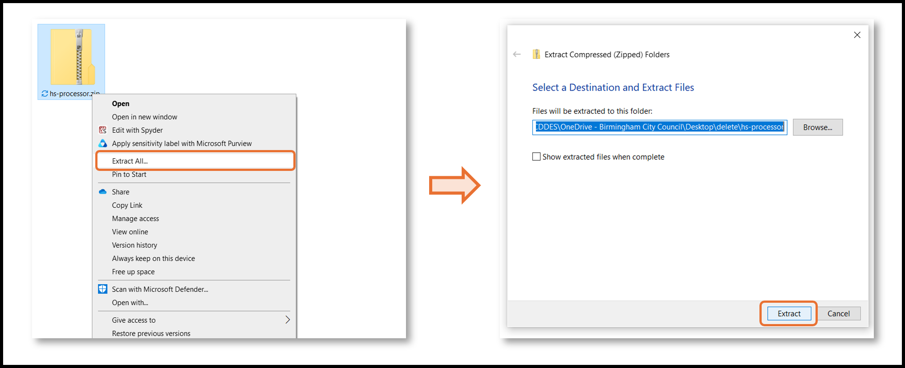
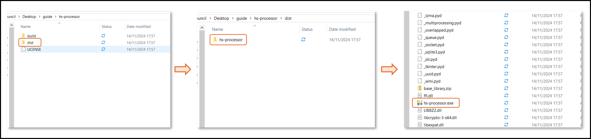
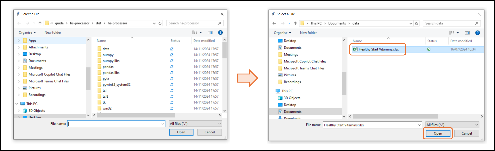
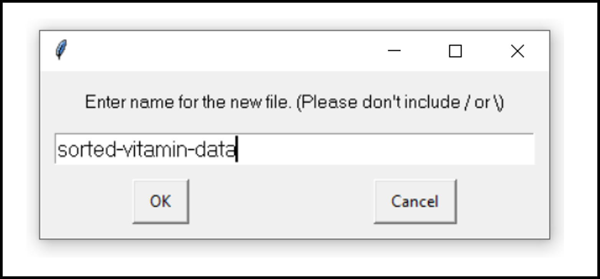
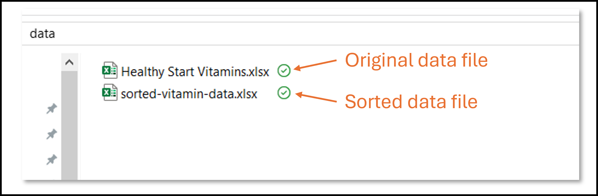

# A&E Healthy Start Data Processor
Executable program for processing health start data received from hospitals. 

## User Guide

### 1. Download
The program can be downloaded pre-installed from [here](https://bcc-phm.github.io/downloads/hs-processor.zip).

### 2. Unzip folder
Right-click the downloaded zip file and click "Extract All...". Choose where you want the unzipped file to be saved and click "Extract".


### 3. Run executable
Open the newly unzipped file "hs-processor". Enter the folder called "dist" and then the folder also called "hs-processor". Scroll down until you see a file called "hs-processor.exe". Double click this file. 


### 4. Find the Excel File to Convert
After clicking on the "hs-processor.exe" a file explorer should pop up. Note: Sometimes this file explorer can be hidden behind other windows. Use this file explorer to find the health check Excel file you want to convert.


### 5. Choose the New File Name
After opening your Excel file you will see a new window asking for a name for your new sorted Excel file. This can be whatever you want so long as you don't include / or \. Any file extension (e.g. .xlsx or .csv) will be ignored. 


The new file will be saved in the same folder as your original data file.



Congratulations, you have just converted your health check data file.


## Installating from Source (Devs only)

For Windows, the executable can be created using `pyinstaller` as follows:

```
pyinstaller hs-processor.spec
```

Note: for macOS/Linus the "hs-processor.spec" file must be updated to convert back slashes ("\") to forward slashes ("/").

## Licence 

This repository is dual licensed under the [Open Government v3]([https://www.nationalarchives.gov.uk/doc/open-government-licence/version/3/) & MIT. All code can outputs are subject to Crown Copyright
